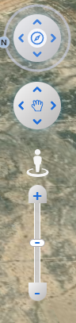

# CameraControl 相机控制组件

CameraControl 是一个功能强大的 Cesium 相机控制组件，提供直观的缩放控制和相机信息显示功能。核心优势是根据外部容器挂载，具有高自由度和开箱即用的特性。



## 特性

- 🎯 **智能容器挂载**: 自动查找或指定容器，灵活挂载
- 🔍 **直观缩放控制**: 滑块式缩放，支持自定义缩放距离
- 📊 **实时相机信息**: 显示位置、高度、朝向等详细信息
- 🧭 **方向指示器**: 实时显示相机朝向和北方指示
- 🎨 **高度可定制**: 支持自定义样式和位置
- ⚡ **开箱即用**: 无需复杂配置，快速集成

## 安装

```bash
npm install cesium-kit
```

## 基础使用

### 1. 导入组件和样式

```javascript
import { createCameraControl } from "cesium-kit";
import "cesium-kit/styles/camera-control.css";
```

### 2. 创建相机控制组件

```javascript
// 创建相机控制组件，自动查找容器并添加
const cameraControl = createCameraControl({
  viewer,
  zoomDistance: 500,
  containerId: "camera-bar", // 可选，指定容器ID
  showCameraInfo: false, // 不显示相机信息
});
```

### 3. HTML 结构

```html
<div class="map-container">
  <div
    class="viewer-container"
    ref="viewerContainer"
    id="viewerContainer"
  ></div>
  <div id="camera-bar" class="camera-bar"></div>
</div>
```

### 4. CSS 样式

```css
.map-container {
  position: relative;
  width: 100%;
  height: 100%;
}

.viewer-container {
  width: 100%;
  height: 100%;
  position: relative;
}

.camera-bar {
  position: absolute;
  top: 20px;
  right: 20px;
}
```

## 配置选项

### CameraControlOptions

| 参数                 | 类型            | 默认值      | 描述                                               |
| -------------------- | --------------- | ----------- | -------------------------------------------------- |
| `viewer`             | `Cesium.Viewer` | -           | **必需** Cesium 查看器实例                         |
| `zoomDistance`       | `number`        | `500`       | 缩放距离（米）                                     |
| `containerId`        | `string`        | `undefined` | 指定容器 ID，不指定则自动查找                      |
| `showCameraInfo`     | `boolean`       | `false`     | 是否显示相机信息面板                               |
| `movementSpeedScale` | `number`        | `1`         | 平移速度系数（整体快慢调节），与高度自适应步长叠加 |

## 使用场景

### 场景 1: 基础缩放控制

```javascript
const cameraControl = createCameraControl({
  viewer,
  zoomDistance: 1000, // 1公里缩放距离
});
```

### 场景 2: 带相机信息显示

```javascript
const cameraControl = createCameraControl({
  viewer,
  zoomDistance: 500,
  showCameraInfo: true, // 显示相机信息
});
```

### 场景 3: 指定容器位置

### 场景 4: 调整平移速度（更丝滑）

```ts
const cameraControl = createCameraControl({
  viewer,
  movementSpeedScale: 0.8, // 位置移动整体更慢
});
```

说明：位置移动步长还会随高度自动调节（越低越慢、越高越快），`movementSpeedScale` 是全局倍率。

```javascript
const cameraControl = createCameraControl({
  viewer,
  containerId: "my-camera-control", // 指定容器
  zoomDistance: 200,
});
```

```html
<div id="my-camera-control" class="custom-camera-container"></div>
```

## 核心优势

### 1. 高自由度挂载

- **自动查找**: 不指定 `containerId` 时，自动查找 Cesium 容器
- **指定容器**: 通过 `containerId` 精确控制挂载位置
- **灵活布局**: 支持任意 CSS 定位和样式

### 2. 开箱即用

- **零配置**: 最小配置即可使用
- **自动初始化**: 自动创建 DOM 元素和事件监听
- **智能适配**: 自动适配不同屏幕尺寸

### 3. 丰富的交互体验

- **平滑缩放/旋转/平移**: 长按采用 requestAnimationFrame 连续执行，60fps 丝滑
- **实时反馈**: 缩放过程中实时更新相机位置
- **视觉指示**: 方向指示器和相机信息面板

### 4. 旋转体验优化

- 上/下旋转采用俯仰折叠与朝向联动（取余式），越过 ±90° 无停顿、无突跳，可连续循环

### 5. 位置移动体验优化

- 平移（前/后/左/右）基于相机坐标系移动，并根据当前高度自适应步长：越低越慢、越高越快

## API 参考

### 实例方法

#### `destroy()`

销毁相机控制组件，清理所有事件监听和 DOM 元素。

```javascript
cameraControl.destroy();
```

#### `getContainer()`

获取相机控制组件的容器元素。

```javascript
const container = cameraControl.getContainer();
```

## 样式定制

### CSS 类名

组件使用以下 CSS 类名，可以通过覆盖样式进行定制：

```css
/* 主容器 */
.cesium-kit-camera-control {
}

/* 缩放滑块 */
.cesium-kit-zoom-slider {
}

/* 相机信息面板 */
.cesium-kit-camera-info {
}

/* 方向指示器 */
.cesium-kit-north-indicator {
}
```

### 自定义样式示例

```css
/* 自定义相机控制样式 */
.cesium-kit-camera-control {
  background: rgba(0, 0, 0, 0.8);
  border-radius: 8px;
  padding: 10px;
}

/* 自定义滑块样式 */
.cesium-kit-zoom-slider {
  background: linear-gradient(to top, #007bff, #28a745);
}
```

## 完整示例

```javascript
import * as Cesium from "cesium";
import { createCameraControl } from "cesium-kit";
import "cesium-kit/styles/camera-control.css";

// 初始化 Cesium
const viewer = new Cesium.Viewer("viewerContainer");

// 创建相机控制
const cameraControl = createCameraControl({
  viewer,
  zoomDistance: 500,
  containerId: "camera-bar",
  showCameraInfo: true,
});

// 组件销毁时清理
window.addEventListener("beforeunload", () => {
  cameraControl.destroy();
});
```

```html
<!DOCTYPE html>
<html>
  <head>
    <link
      href="https://cesium.com/downloads/cesiumjs/releases/1.103/Build/Cesium/Widgets/widgets.css"
      rel="stylesheet"
    />
    <script src="https://cesium.com/downloads/cesiumjs/releases/1.103/Build/Cesium/Cesium.js"></script>
  </head>
  <body>
    <div class="map-container">
      <div id="viewerContainer" class="viewer-container"></div>
      <div id="camera-bar" class="camera-bar"></div>
    </div>

    <style>
      .map-container {
        position: relative;
        width: 100vw;
        height: 100vh;
      }

      .viewer-container {
        width: 100%;
        height: 100%;
      }

      .camera-bar {
        position: absolute;
        top: 20px;
        right: 20px;
        z-index: 1000;
      }
    </style>
  </body>
</html>
```

## 注意事项

1. **容器要求**: 确保指定的容器 ID 在 DOM 中存在
2. **样式依赖**: 必须导入 `camera-control.css` 样式文件
3. **内存管理**: 组件销毁时调用 `destroy()` 方法清理资源
4. **Cesium 版本**: 需要 Cesium 1.103.0 或更高版本

## 故障排除

### 常见问题

**Q: 组件没有显示？**
A: 检查是否正确导入了 CSS 文件，确认容器 ID 存在。

**Q: 缩放不生效？**
A: 确认 `viewer` 参数正确传递，检查 Cesium 版本兼容性。

**Q: 样式显示异常？**
A: 检查 CSS 文件是否正确加载，确认没有样式冲突。
