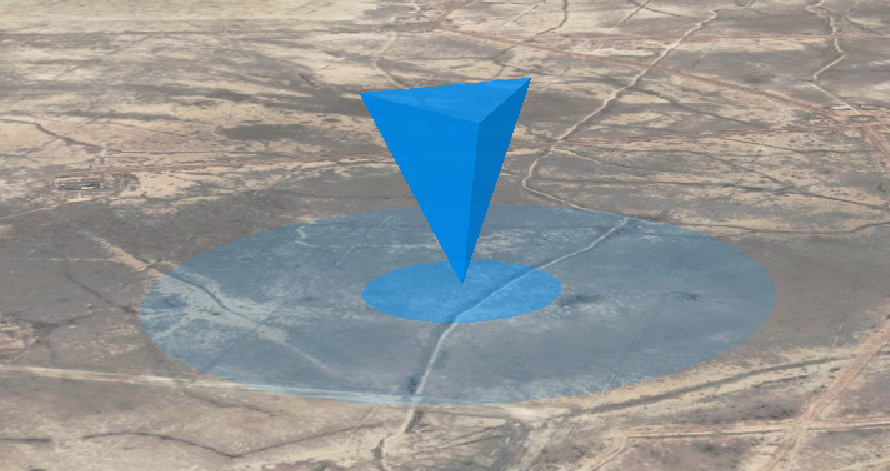

# RippleMarker

在 Cesium 场景中添加一个带扩散波纹的 3D 标点（倒立三棱锥），支持标签显示、点击事件和数据绑定。



## 基础用法

```ts
import { Viewer } from "cesium";
import { RippleMarker } from "globex";

const viewer = new Viewer("container");

const marker = RippleMarker(viewer, {
  lon: 116.3913,
  lat: 39.9075,
  height: 0,
  color: "rgba(0,150,255,0.8)",
  maxRadius: 8000,
  duration: 1500,
  loops: Infinity,
  pyramidHeight: 1000,
  baseRadius: 300,
  floatEnabled: true,
  surfaceHeight: 50,
});

// 控制显示/隐藏
marker.show();
marker.hide();
marker.setVisible(false);

// 移除标记
marker.remove();
```

## 高级用法

### 带标签和点击事件

```ts
const marker = RippleMarker(viewer, {
  lon: 116.3913,
  lat: 39.9075,
  id: "beijing-marker",
  data: {
    name: "北京",
    type: "capital",
    population: 21540000,
  },
  label: {
    text: "北京市",
    font: "18px sans-serif",
    fillColor: "#ffffff",
    outlineColor: "#000000",
    outlineWidth: 2,
    pixelOffset: { x: 0, y: -50 },
    scale: 1.2,
    show: true,
  },
  onClick: (data, position) => {
    console.log("点击了:", data.name);
    console.log("位置:", position.lon, position.lat);
    // 可以在这里处理点击逻辑，如显示详情弹窗等
  },
});
```

### 批量管理标记

```ts
const markers: RippleMarker[] = [];

// 添加多个标记
const cities = [
  { name: "北京", lon: 116.3913, lat: 39.9075 },
  { name: "上海", lon: 121.4737, lat: 31.2304 },
  { name: "广州", lon: 113.2644, lat: 23.1291 },
];

cities.forEach((city) => {
  const marker = RippleMarker(viewer, {
    lon: city.lon,
    lat: city.lat,
    id: `city-${city.name}`,
    data: city,
    label: {
      text: city.name,
      font: "16px sans-serif",
      fillColor: "#00ff88",
      pixelOffset: { x: 0, y: -40 },
    },
    onClick: (data) => {
      alert(`欢迎来到${data.name}！`);
    },
  });
  markers.push(marker);
});

// 批量隐藏所有标记
markers.forEach((marker) => marker.hide());

// 批量删除所有标记
markers.forEach((marker) => marker.remove());
```

---

## API 参考

### RippleMarker(viewer, options)

创建一个带波纹动画的 3D 标记。

**参数:**

- **viewer**: `Cesium.Viewer` 实例
- **options**: `RippleMarkerOptions` 配置对象

**返回值:** `RippleMarker` 对象，包含控制方法

### RippleMarkerOptions

#### 基础配置

- **lon**: `number` - 经度（必填）
- **lat**: `number` - 纬度（必填）
- **height**?: `number` - 海拔高度（米），默认 `0`
- **id**?: `string` - 唯一标识符，用于事件识别
- **data**?: `any` - 绑定数据，点击时在回调中返回

#### 视觉配置

- **color**?: `string` - 三棱锥颜色，CSS 颜色字符串，默认 `'rgba(0,150,255,0.8)'`
- **pyramidHeight**?: `number` - 三棱锥高度（米），默认 `1000`
- **baseRadius**?: `number` - 三棱锥底部半径（米），默认 `pyramidHeight * 0.3`
- **surfaceHeight**?: `number` - 三棱锥与波纹基准高度（米），默认 `50`

#### 动画配置

- **maxRadius**?: `number` - 波纹最大半径（米），默认 `8000`
- **duration**?: `number` - 单个波纹周期（毫秒），默认 `1500`
- **loops**?: `number` - 循环次数，`Infinity` 表示无限循环，默认 `Infinity`
- **floatEnabled**?: `boolean` - 是否启用上下浮动动画，默认 `true`

#### 标签配置

- **label**?: `LabelOptions` - 标签配置对象

#### 事件配置

- **onClick**?: `(data: any, position: { lon: number, lat: number }) => void` - 点击回调函数

### LabelOptions

- **text**?: `string` - 标签文字
- **font**?: `string` - 字体样式，如 `'16px sans-serif'`，默认 `'14px sans-serif'`
- **fillColor**?: `string` - 文字颜色，CSS 颜色字符串，默认 `'#ffffff'`
- **outlineColor**?: `string` - 描边颜色，CSS 颜色字符串，默认 `'#000000'`
- **outlineWidth**?: `number` - 描边宽度，默认 `2`
- **pixelOffset**?: `{ x: number, y: number }` - 像素偏移，默认 `{ x: 0, y: -45 }`
- **scale**?: `number` - 文字缩放，默认 `1.0`
- **show**?: `boolean` - 是否显示标签，默认 `true`

### RippleMarker 对象方法

- **remove()**: `() => void` - 移除标记及其所有相关实体
- **show()**: `() => void` - 显示标记
- **hide()**: `() => void` - 隐藏标记
- **setVisible(visible: boolean)**: `(visible: boolean) => void` - 设置可见性

---

## 特性说明

### 自动渲染优化

RippleMarker 会自动启用连续渲染模式，确保动画流畅运行，无需手动配置。

### 事件处理

- 点击事件会返回绑定的 `data` 和点击位置的经纬度
- 支持多个标记的独立事件处理
- 自动清理事件监听器，避免内存泄漏

### 性能优化

- 使用 Cesium 的 CallbackProperty 实现高效动画
- 自动管理实体生命周期
- 支持批量操作和统一管理

### 类型安全

完整的 TypeScript 类型定义，提供智能提示和类型检查。

---
